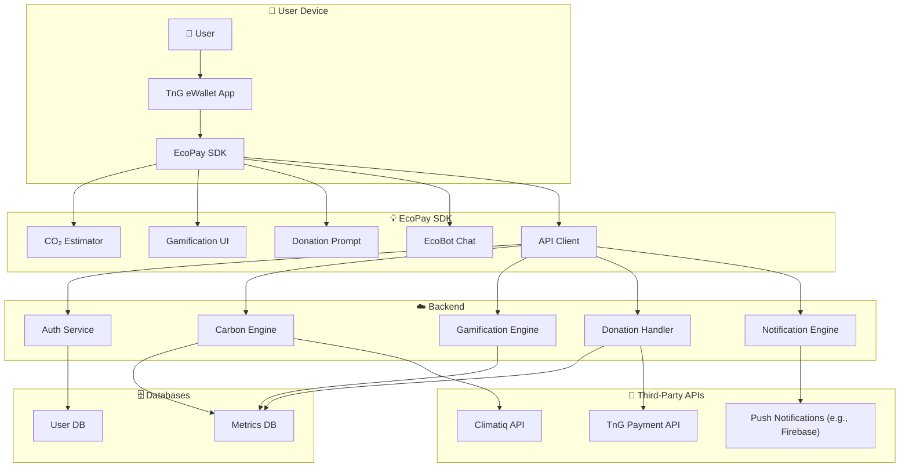

# 🌱 EcoPay

**EcoPay** is a sustainability-focused plugin designed to integrate directly into e-wallets like **Touch ‘n Go (TnG)**. Built with Flutter, EcoPay helps Gen Z users in Malaysia track their carbon footprint, make greener choices, and donate to causes — all while using the payment apps they already love.

---

## 📌 Challenge Overview

This project was developed for **PayHack25 – Challenge 3: ESG/Sustainability**:

> _How can digital payments be leveraged to seamlessly integrate environmental sustainability and social impact into daily transactions?_

---

## 💡 What is EcoPay?

EcoPay is a Flutter-based module that integrates seamlessly into existing digital wallets. It empowers users to:

- 📉 **See their carbon impact** in real-time per purchase
- 🥕 **Make greener spending choices** with nudges (e.g., Chicken > Beef)
- 🎮 **Get rewarded** through badges, tree-growth, and streaks
- 💸 **Donate easily** via round-up donations to verified causes
- 🤖 **Chat with EcoBot**, an AI assistant for sustainability support

---

## 🎯 Why Gen Z?

- 71% of Malaysian Gen Z use digital wallets  
- 66% are willing to pay more for sustainable products  
- But 78% feel powerless without tools to take action  
EcoPay bridges that gap — helping Gen Z act on their values, daily.

---

## 🚀 Features

| Feature | Description |
|--------|-------------|
| 💨 Carbon Estimator | Estimates CO₂ per transaction via [Climatiq API](https://www.climatiq.io/) |
| 🎁 Rewards & Gamification | Leaderboards, tree growth visuals, XP badges, and more |
| 💬 AI Assistant | EcoBot provides answers, tips, and suggestions in multiple languages |
| 🪙 Round-Up Donations | Donates spare change to verified NGOs via TnG |
| 📊 Impact Dashboard | View monthly CO₂ saved, donations made, and progress |
| 🌏 Multi-language & Low-data Mode | BM, English, Mandarin; optimized for rural areas |

---

## 🧠 Architecture



---

## 📱 Screenshots

---

### 🧭 EcoPay Integration
<p float="left">
  
</p>


---

### 🔷 Dashboard Views
<p float="left">
  
  
  
</p>

---

### 🔍 QR Scan Flow
<p float="left">
  
  
  
  
  
</p>

---

### MyContribution page

<p float="left">
  
    
</p>

---


### ✅ Confirmation & Success
<p float="left">
  
</p>

---

### 🕓 Transaction History
<p float="left">
  
</p>


## 🛠️ Getting Started

### Prerequisites

- Flutter SDK (`>=3.x`)
- Dart (`>=3.x`)
- Android Studio or VS Code with Flutter extension
- Firebase project (for push notifications, if used)
- Climatiq API key ([get it here](https://www.climatiq.io/))

### Installation

```bash
git clone https://github.com/your-org/ecopay.git
cd ecopay
flutter pub get
flutter run
```

---

## 📦 Folder Structure

```
📁 Simplified Project Structure (root files + lib + assets):

├── Architecture.md
├── README.md
├── analysis_options.yaml
├── assets
│   ├── animations
│   │   ├── Money growth.json
│   │   ├── Tomato_plant.json
│   │   └── Tree in the wind.json
│   ├── fonts
│   │   └── SpaceMono-Regular.ttf
│   └── images
│       ├── EcoPayIcon.png
│       ├── EcoPayIconremovebg.png
│       ├── malaysia-flag.png
│       └── profile.png
├── generate_tree.py
├── lib
│   ├── helpers
│   │   └── database_helper.dart
│   ├── main.dart
│   ├── models
│   │   ├── balance.dart
│   │   └── transaction.dart
│   ├── screens
│   │   ├── payment_confirmation_screen.dart
│   │   └── touch_n_go_homepage.dart
│   ├── utils
│   │   └── duitnow_qr_parser.dart
│   └── widgets
│       └── receipt_modal.dart
├── pubspec.lock
└── pubspec.yaml
```

---

## 🧪 Future Plans

- [ ] Support multiple wallets (Boost, GrabPay, MAE)
- [ ] Real-time emissions using location and merchant category
- [ ] ESG data marketplace for investors
- [ ] Tree-planting rewards or carbon credit partnerships

---

## 👥 Team

- Aiman – Backend & System Design  
- Azri - UI Design & Backend Support
- Hanim - Presenter
- Kamil - Researcher  

---

## 📄 License

This project is licensed under the MIT License.

---

## 🌍 Together, Let’s Pay It Green.

EcoPay turns every transaction into a tiny step for a better planet — no extra effort required.
