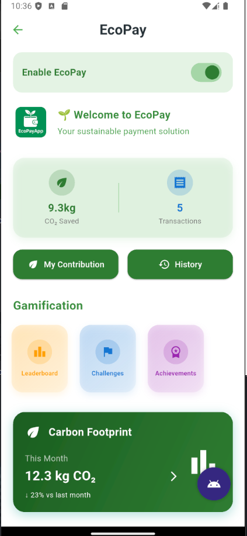
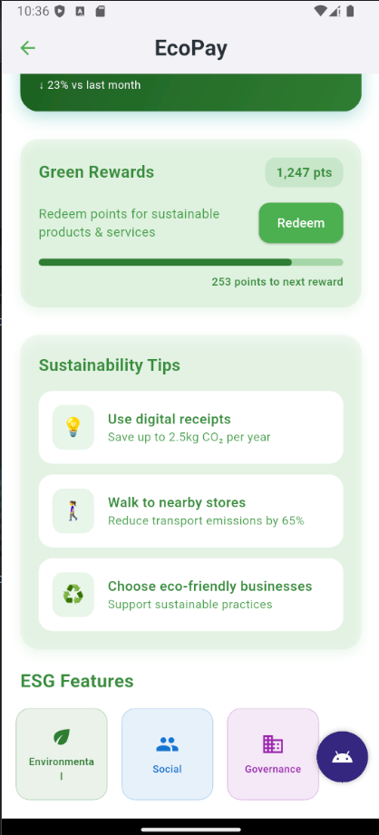
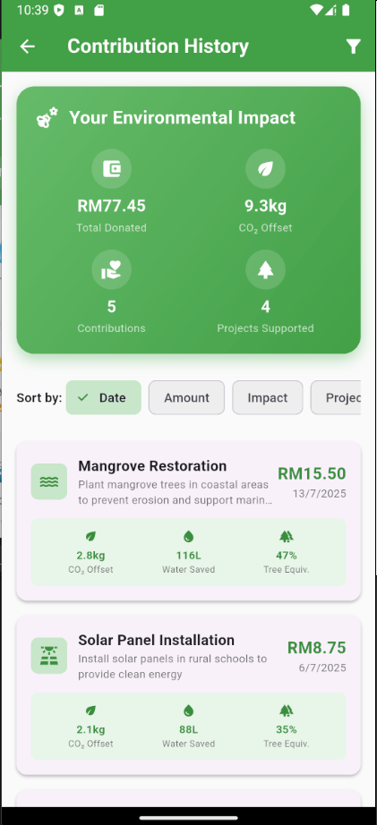

# 🌱 EcoPay

**EcoPay** is a sustainability-focused plugin designed to integrate directly into e-wallets like **Touch ‘n Go (TnG)**. Built with Flutter, EcoPay helps Gen Z users in Malaysia track their carbon footprint, make greener choices, and donate to causes—all while using the payment apps they already love.

---

## 📌 Challenge Overview

This project was developed for **PayHack25 – Challenge 3: ESG/Sustainability**:

> _How can digital payments be leveraged to seamlessly integrate environmental sustainability and social impact into daily transactions?_

Our solution is EcoPay, a feature designed to integrate seamlessly into existing e-wallet platforms like TnG eWallet, aimed at making sustainability part of daily spending habits. Our focus is on Gen Z consumers in Malaysia. They are tech-savvy, socially aware, and already active users of digital wallets. They care about the environment but don’t always know how to help. EcoPay empowers them to make better choices through the payment experience they already use.

---

## The Problem

### 🌍 Environmental & Social Challenges

Today, ESG efforts are mostly limited to corporations and investors. Regular consumers are left out, even though they are part of the impact chain. There is no easy or engaging way for users to:
- **Understand their carbon footprint**: Most consumers have no visibility into how their daily purchases contribute to climate change
- **Make greener spending choices**: Lack of real-time information about environmental impact of products/services at point of purchase
- **Contribute to social or environmental causes through payments**: No seamless integration of charitable giving into everyday transactions

Despite the rise of e-wallets and DuitNow QR in Malaysia, these platforms do not currently promote sustainability in a meaningful way.

### 🏢 Market & Adoption Barriers

#### Consumer Behavior Challenges:
- **Sustainability Fatigue**: Users may become overwhelmed by constant environmental messaging and disengage
- **Price Sensitivity**: Malaysian consumers, especially Gen Z, may prioritize cost over sustainability despite stated preferences
- **Digital Literacy Gaps**: Rural users and older demographics may struggle with gamification and impact tracking features
- **Trust Issues**: Users may be skeptical of environmental impact calculations without third-party verification

#### Business Integration Challenges:
- **E-Wallet Integration Complexity**: Each e-wallet platform (TnG, Boost, GrabPay) has different APIs and integration requirements
- **Merchant Adoption**: Requires cooperation from merchants to provide detailed product information for accurate impact calculations
- **Revenue Model Uncertainty**: Unclear sustainable business model for funding the platform long-term
- **Regulatory Compliance**: Need to comply with financial regulations and data protection laws across different jurisdictions

---

## 💡 EcoPay: What It Does

EcoPay is designed as a plug-in or native feature inside existing e-wallet apps. It educates, nudges, and rewards users for making greener and more socially responsible spending decisions.

### Core Features:
- **Greener Options**: Show users better choices during checkout (e.g., Chicken > Beef, MRT > Ride-share).
- **Impact Display**: Example: "This meal produced 4.5kg CO₂" or "You saved 1.8kg CO₂ by buying local."
- **Gamification**: Sync with friends to see top 10 green spenders and earn rewards like cashback or badges.
- **Motivation & Progress**: A virtual tree graphic grows with your positive impact, and a monthly dashboard shows CO₂ saved, donations, etc.
- **Inclusive Design**: Multilanguage support (English, BM, Mandarin), simple icons for low-literacy users, and a low-data mode for rural areas.
- **Round-Up Donations**: Round up to the nearest RM and donate the difference to verified causes.
- **AI Chatbot Assistant**: Replaces the FAQ and helps users navigate features easily.

---

## 🚀 Features Summary

| Feature                 | Description                                                                    |
| ----------------------- | ------------------------------------------------------------------------------ |
| 💨 **Carbon Estimator** | Estimates CO₂ per transaction via local calculations.                          |
| 🎁 **Rewards & Gamification** | Includes leaderboards, achievements, and challenges to reward sustainable behavior. |
| 🪙 **Round-Up Donations**   | Donates spare change to verified NGOs via TnG.                                 |
| 📊 **Impact Dashboard**    | View monthly CO₂ saved, donations made, and progress.                          |
| 🌏 **Local Project Support**| Enables users to support local environmental projects in Malaysia.             |
| 📱 **QR Code Payments**   | Supports DuitNow QR payments with an integrated scanner.                         |

---

## Why This Matters for Malaysia

- Most Malaysians are unaware of how daily purchases affect the environment.
- ESG remains siloed within big business and finance.
- Climate risks like floods and pollution are rising.
- Digital payments are growing rapidly but not leveraged for social or climate impact.

EcoPay turns spending into action.

---

## 🎯 Target Audience: Why Gen Z?

- **High e-wallet usage**: 71% of Malaysian Gen Z use digital wallets.
- **Strong climate concern**: 71% report experiencing climate anxiety.
- **Social media-driven**: Fast adoption and peer influence are key to their habits.
- **Willing to pay more for eco-products**: 66% are open to a premium for sustainable goods.
- **Tech-savvy & early adopters**: The perfect group to scale awareness and drive change.

---

## ✨ Positive Outcomes

### For Consumers:
- Everyday people can now contribute to sustainability.
- Greater awareness of their carbon footprint and spending habits.
- An easy, rewarding experience that builds good habits.

### For Malaysia:
- Boosts public involvement in national sustainability goals.
- Local data and behavior insights can inform policy.
- Positions Malaysia as an ESG leader in the ASEAN region.

---

## 💼 Impact for Investors

- **ESG now affects returns**: It’s a smart financial move, not just a moral one.
- **Demand for real data**: We offer measurable CO₂, donation, and behavior metrics.
- **Aligned with national policies**: Fits Bank Negara, SRI taxonomy, and ESG mandates.
- **Green finance is growing**: Our app fits green sukuk and ESG fund goals.
- **Scalable ESG enabler**: One product can impact millions through a single e-wallet.
- **Reduces greenwashing risk**: Transparent calculations and trusted sources build confidence.

---

## 🧠 Architecture

---

---

## 🧠 DataBase Structure

---

## 🔩 Modules Overview

### `main.dart`
- **Entry Point**: Initializes the Flutter application and sets up the main theme and routing.

### `screens`
- **UI/UX**: Contains all major user-facing screens, including the EcoPay dashboard, QR scanner, payment confirmation, and leaderboards.

### `helpers`
- **`database_helper.dart`**: Manages the local `sqflite` database, handling all CRUD operations for transactions, users, contributions, and achievements.
- **`gamification_helper.dart`**: Implements the logic for achievements and challenges based on user activity.

### `models`
- **Data Structures**: Defines the data models for `User`, `Transaction`, `Contribution`, `Project`, and other core entities.

### `utils`
- **`duitnow_qr_parser.dart`**: Parses DuitNow QR codes to extract merchant information and other payment details.
- **`environmental_impact_calculator.dart`**: Calculates the carbon footprint and other environmental metrics for each transaction.

### `widgets`
- **Reusable Components**: Includes custom widgets like the `receipt_modal.dart` to maintain a consistent UI across the app.

---

## 📱 Screenshots

---

### 🧭 EcoPay Integration
<p float="left">
  
</p>

---

### 🔷 Dashboard Views
<p float="left">
  
  
  
</p>

---

### 🔍 QR Scan Flow
<p float="left">
  
  
  
  
</p>

---

### MyContribution page

<p float="left">
  
</p>

---


### ✅ Confirmation & Success
<p float="left">
  
</p>

---

### 🕓 Transaction History
<p float="left">
  
</p>

## 🛠️ Getting Started

### Prerequisites

- Flutter SDK (`>=3.x`)
- Dart (`>=3.x`)
- Android Studio or VS Code with Flutter extension

### Installation

```bash
git clone https://github.com/your-org/ecopay.git
cd ecopay
flutter pub get
flutter run
```

---

## 📦 Folder Structure

```
📁 Simplified Project Structure (root files + lib + assets):

├── Architecture.md
├── README.md
├── analysis_options.yaml
├── assets
│   ├── animations
│   │   ├── Money growth.json
│   │   ├── Tomato_plant.json
│   │   └── Tree in the wind.json
│   ├── fonts
│   │   └── SpaceMono-Regular.ttf
│   └── images
│       ├── EcoPayIcon.png
│       ├── EcoPayIconremovebg.png
│       ├── malaysia-flag.png
│       └── profile.png
├── generate_tree.py
├── lib
│   ├── helpers
│   │   ├── database_helper.dart
│   │   └── gamification_helper.dart
│   ├── main.dart
│   ├── models
│   │   ├── achievement.dart
│   │   ├── balance.dart
│   │   ├── contribution.dart
│   │   ├── project.dart
│   │   ├── transaction.dart
│   │   └── user.dart
│   ├── screens
│   │   ├── achievements_screen.dart
│   │   ├── challenges_screen.dart
│   │   ├── donation_history_screen.dart
│   │   ├── ecopay_screen.dart
│   │   ├── leaderboard_screen.dart
│   │   ├── local_projects_screen.dart
│   │   ├── my_contribution_screen.dart
│   │   ├── payment_confirmation_screen.dart
│   │   ├── qr_scanner_screen.dart
│   │   ├── touch_n_go_homepage.dart
│   │   └── transaction_history_screen.dart
│   ├── utils
│   │   ├── duitnow_qr_parser.dart
│   │   └── environmental_impact_calculator.dart
│   └── widgets
│       └── receipt_modal.dart
├── pubspec.lock
└── pubspec.yaml
```

---

## 🧪 Future Plans

```mermaid
%%{init: {
  "theme": "base",
  "themeVariables": {
    "fontFamily": "Segoe UI, sans-serif",
    "fontSize": "14px",
    "lineColor": "#546E7A",
    "textColor": "#263238"
  }
}}%%
graph TD
  %% Main Phases
  P1[<b style='color:#1B5E20;'>Phase 1:</b><br>Foundation<br><span style='font-size:12px;'>0–12 Months</span>]
  P2[<b style='color:#0D47A1;'>Phase 2:</b><br>Expansion<br><span style='font-size:12px;'>1–3 Years</span>]
  P3[<b style='color:#4A148C;'>Phase 3:</b><br>Ecosystem<br><span style='font-size:12px;'>3–5 Years</span>]
  D[<b style='color:#00695C;'>🌍 Global Scalability</b>]

  %% Phase 1 Components
  P1 --> A1[📱 TnG Integration]
  P1 --> A2[🌿 Core Carbon Tracker]
  P1 --> A3[🎮 Gamification Engine]
  P1 --> A4[🤖 AI Assistant]

  %% Phase 2 Components
  P2 --> B1[🏦 Banking Partners<br>Maybank, CIMB]
  P2 --> B2[🛒 Retail Integrations<br>Starbucks, Lotus's]
  P2 --> B3[🧠 Behavioral AI<br>Personalized Green Tips]
  P2 --> B4[🌏 ASEAN Localization]

  %% Phase 3 Components
  P3 --> C1[📊 ESG Data Marketplace]
  P3 --> C2[♻️ Carbon Credit Exchange]
  P3 --> C3[🌳 Tree-Planting Rewards]
  P3 --> C4[🤝 Gov API Integration]

  %% Flow Logic
  A1 & A2 & A3 & A4 --> P2
  B1 & B2 & B3 & B4 --> P3
  P3 -.-> D

  %% Custom Styling Classes
  classDef greenPhase fill:#E8F5E9,stroke:#1B5E20,stroke-width:2px;
  classDef bluePhase fill:#E3F2FD,stroke:#0D47A1,stroke-width:2px;
  classDef purplePhase fill:#F3E5F5,stroke:#4A148C,stroke-width:2px;
  classDef finalGoal fill:#E0F2F1,stroke:#00695C,stroke-width:2px,font-weight:bold;

  class P1 greenPhase;
  class P2 bluePhase;
  class P3 purplePhase;
  class D finalGoal;

```


---

## 👥 Team

- Aiman – Backend & System Design
- Azri - UI Design & Backend Support
- Hanim - Presenter
- Kamil - Researcher

---

## 📄 License

This project is licensed under the MIT License.

---

## Conclusion

EcoPay makes sustainable living part of everyday digital life. By embedding impact into payments, we empower a new generation to take meaningful climate and social action — one transaction at a time.
We believe this is how Malaysia can lead in green fintech for the region.

---

## 🌍 Together, Let’s Pay It Green.

EcoPay turns every transaction into a tiny step for a better planet—no extra effort required.
